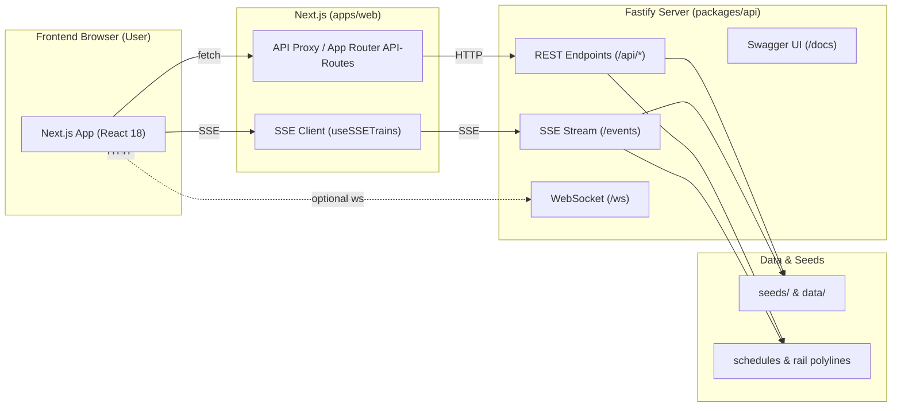

# System Overview

Die Mermaid-Grafik visualisiert die Hauptkomponenten und Datenflüsse.

Hinweise:

- Frontend spricht die API entweder direkt via `NEXT_PUBLIC_API_BASE` oder via Proxy-/Route-Helfer (`upstreamJson`).
- Realtime-Daten werden primär via SSE bereitgestellt; WS ist optionaler Fallback.
- Swagger/OpenAPI ist unter `/docs` verfügbar; formale Spezifikation zusätzlich in `docs/openapi.yaml`.
